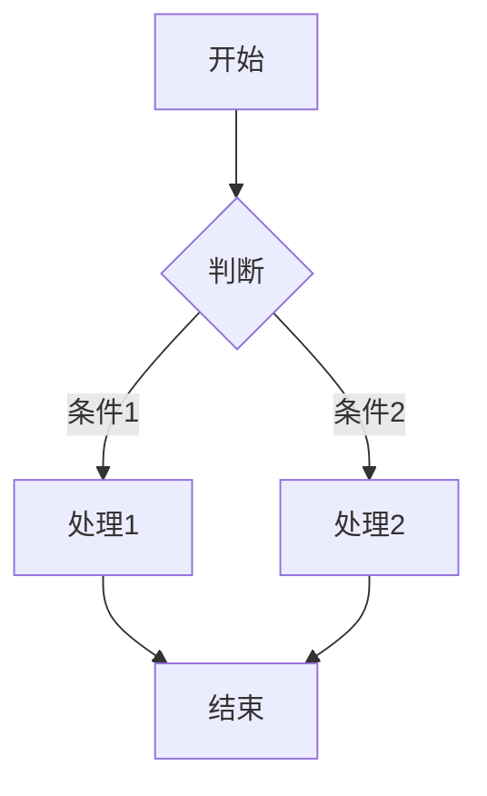
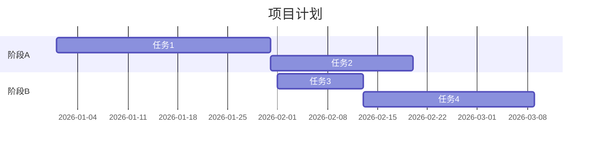
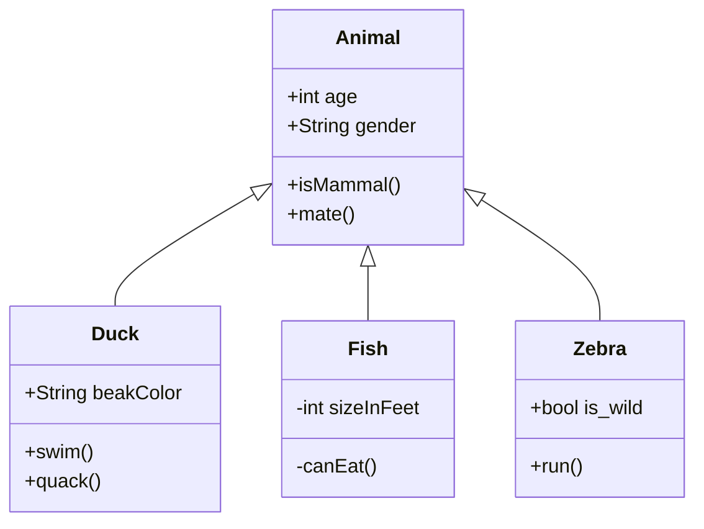

# Mermaid 流程图测试

## 基本流程图

```mermaid
graph TD
    A[开始] --> B{判断}
    B -->|条件1| C[处理1]
    B -->|条件2| D[处理2]
    C --> E[结束]
    D --> E
```

## 甘特图

```mermaid
gantt
    title 项目计划
    dateFormat  YYYY-MM-DD
    section 阶段A
    任务1           :a1, 2026-01-01, 30d
    任务2           :after a1, 20d
    section 阶段B
    任务3           :2026-02-01, 12d
    任务4           :24d
```

## 类图

```mermaid
classDiagram
    Animal <|-- Duck
    Animal <|-- Fish
    Animal <|-- Zebra
    Animal : +int age
    Animal : +String gender
    Animal: +isMammal()
    Animal: +mate()
    class Duck{
        +String beakColor
        +swim()
        +quack()
    }
    class Fish{
        -int sizeInFeet
        -canEat()
    }
    class Zebra{
        +bool is_wild
        +run()
    }
```
